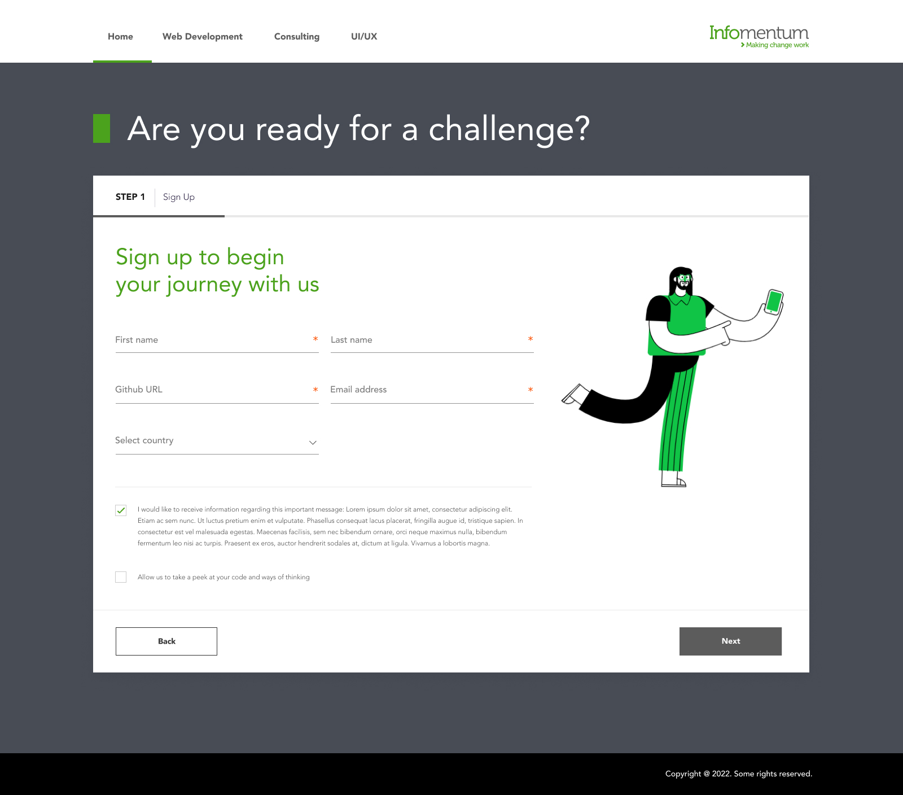

# IMUI Challange

## Table of contents

- [Overview](#overview)
  - [IMUI Task](#imui-task)
  - [Screenshot](#screenshot)
  - [Quick Start ](#quick-start)
 

## Overview

### IMUI Task

Users should be able see:

- 3 step form 
- Bacis Info | Others | Sills set
- Animation completion bar highlight
- Validation of fields
- Go next/prev
- Review ansers
- Sucessfully submitted

### Screenshot

### Quick Start

RUN `npm install` -  To install the dependencies
Run `npm run dev` - To quick run the project via Parcel

On run `npm run dev` You will able to see message like below 
`Server running at http://localhost:1234' 

Thats it!
